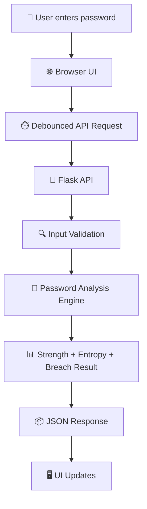
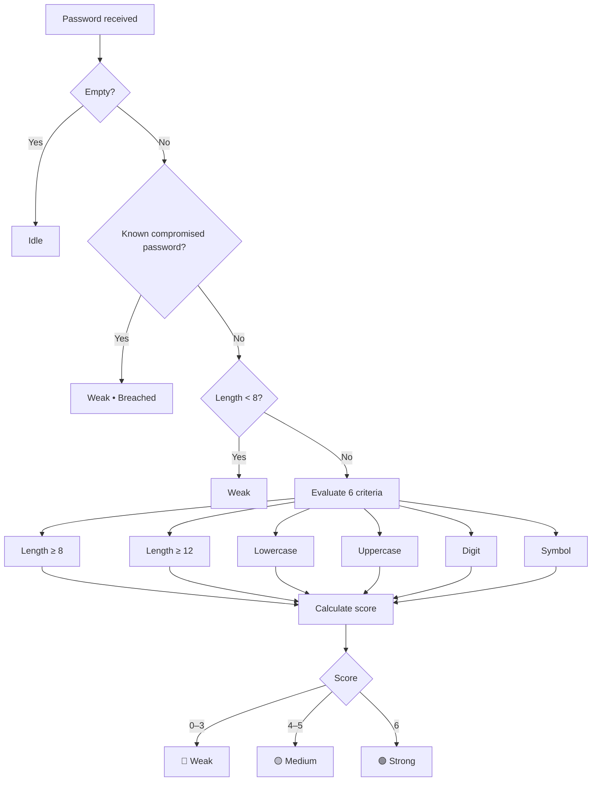
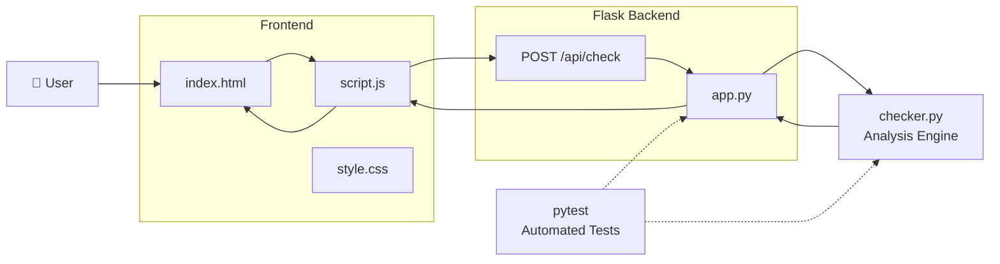
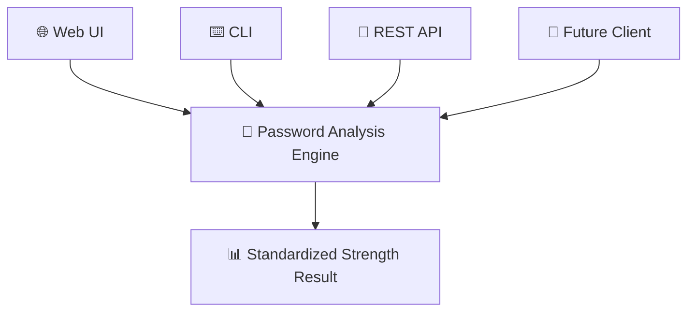

<div align="center">

# 🔐 Password Strength Analyzer

### A privacy-first, real-time password security analyzer built with Flask & Python.

Analyze password strength through **length, character diversity, estimated entropy, and breach exposure** — while keeping the original password out of responses, storage, and application logs.

<br>


<br>

**Built by Awais Khan**

</div>

---

## 🖥️ Project Preview

> A terminal-inspired web interface that gives users immediate, understandable feedback about password quality.

### 🔴 Weak Password State


### 🟡 Medium Password State


### 🟢 Strong Password State


# 🎯 Why This Project?

Weak passwords remain one of the simplest ways an account can be compromised.

This project demonstrates how a web application can provide **actionable password feedback** without treating the password itself as application data.

Instead of simply saying:

> ❌ "Your password is weak."

the analyzer explains **why**:

* Is it long enough?
* Does it contain multiple character classes?
* How much estimated entropy does it have?
* Does it appear in the bundled compromised-password sample?
* Which security requirements are still missing?

The goal is to combine **security engineering, backend validation, frontend UX, accessibility, and automated testing** into one focused application.

---

# ✨ Features

### ⚡ Real-Time Analysis

Password feedback updates while the user types using a debounced JavaScript request to the Flask JSON API.

### 🧠 Multi-Factor Strength Scoring

The analyzer evaluates six criteria:

* Length ≥ 8 characters
* Length ≥ 12 characters
* Lowercase characters
* Uppercase characters
* Numbers
* Symbols

### 📊 Entropy Estimation

An estimated entropy value is calculated in bits using the character classes present in the password.

### 🚨 Breach Detection

Passwords are checked against a bundled sample of commonly compromised passwords.

### 🔒 Privacy by Design

The API returns **derived analysis rather than the original password**.

The application is designed so that the plaintext password is not:

* Stored in a database
* Returned in the API response
* Written to application logs
* Included in error messages

### 🛡️ Defensive Backend

The Flask application includes:

* JSON validation
* Maximum request-size protection
* Maximum password length
* Structured API errors
* Debugger disabled by default

### ♿ Accessible Interface

The UI includes:

* Semantic form controls
* Proper labels
* Keyboard-friendly interaction
* `aria-live` feedback regions
* Clear visual status indicators

### 🧪 Automated Testing

The project includes tests for both:

* Password-analysis logic
* Flask API behavior

Including malformed JSON, invalid types, oversized passwords, and password-leakage checks.

---

# 🧭 How It Works

The application follows a simple pipeline:



### Important design principle

The browser sends the password to the local application for analysis, but the application does **not need to persist it**.

```text
Password
   │
   ▼
Validation
   │
   ▼
Analysis
   │
   ├── Strength score
   ├── Character checks
   ├── Entropy estimate
   └── Breach lookup
   │
   ▼
Derived JSON result
   │
   ▼
Browser
```

---

# 🧮 Password Scoring

The scoring engine is intentionally deterministic and framework-independent.



### Scoring model

| Score | Verdict   | Meaning                                        |
| :---: | --------- | ---------------------------------------------- |
| `0–3` | 🔴 Weak   | Missing several important characteristics      |
| `4–5` | 🟡 Medium | Reasonable complexity but room for improvement |
|  `6`  | 🟢 Strong | Meets all defined complexity criteria          |

> **Important:** This score is an educational strength indicator, not a guarantee that a password is unbreakable.

---

# 🏗️ Architecture



### Separation of concerns

The core analysis logic lives in:

```text
checker.py
```

It has **no Flask dependency**, meaning the scoring engine can be reused by:

* The web application
* Unit tests
* A future CLI
* Future API clients
* Other interfaces

This separation keeps the project easier to test and maintain.

---

# 📡 API

## `POST /api/check`

Analyzes a password and returns its derived security information.

### Request

```json
{
  "password": "ExamplePassword123!"
}
```

### Response

```json
{
  "verdict": "Strong",
  "score": 6,
  "entropy": 131.1,
  "leaked": false,
  "checks": {
    "length_8plus": true,
    "length_12plus": true,
    "has_lowercase": true,
    "has_uppercase": true,
    "has_digit": true,
    "has_symbol": true
  },
  "reasons": [
    "Meets all checked criteria."
  ]
}
```

### Response fields

| Field     | Type      | Description                                            |
| --------- | --------- | ------------------------------------------------------ |
| `verdict` | `string`  | `Idle`, `Weak`, `Medium`, or `Strong`                  |
| `score`   | `integer` | Score from 0–6                                         |
| `entropy` | `number`  | Estimated entropy in bits                              |
| `leaked`  | `boolean` | Whether the password matched the bundled breach sample |
| `checks`  | `object`  | Individual strength criteria                           |
| `reasons` | `array`   | Human-readable feedback                                |

### Error handling

| Status | Meaning                               |
| :----: | ------------------------------------- |
|  `200` | Valid password analysis               |
|  `400` | Invalid or missing password field     |
|  `413` | Request exceeds configured size limit |
|  `404` | Unknown route                         |

---

# 🔐 Security Design

Security is one of the primary goals of this project.

## No plaintext persistence

The application does not intentionally store passwords in:

* Databases
* Files
* Sessions
* API responses
* Application logs

## Input limits

The application limits:

```text
Request body  → 16 KB
Password      → 256 characters
```

This prevents unnecessarily large payloads from reaching the analysis layer.

## Debug mode

The Flask development debugger is disabled by default.

For production deployments, the application should run behind a production WSGI server rather than Flask's development server.

## Breach database

The repository currently contains a **small illustrative compromised-password sample**.

This is useful for demonstrating the feature, but it should not be interpreted as a comprehensive breach database.

For a production-grade implementation, a service such as Have I Been Pwned's Pwned Passwords API using its k-anonymity approach would be a stronger option.

---

# 🧪 Testing

Run the complete test suite with:

```bash
pytest -v --cov=. --cov-report=term-missing
```

The test suite covers:

```text
Password Analysis
├── Empty passwords
├── Short passwords
├── Character-class detection
├── Score calculation
├── Entropy calculation
└── Compromised-password detection

Flask API
├── Valid requests
├── Missing fields
├── Invalid JSON
├── Invalid data types
├── Oversized input
├── Error responses
└── Password non-disclosure
```

### Current test coverage

**19 automated tests**

GitHub Actions runs the test suite across:

```text
Python 3.10
Python 3.11
Python 3.12
```

---

# ⚡ Quick Start

## 1. Clone the repository

```bash
git clone https://github.com/Shadow-Exe64/password-strength-analyzer.git
cd password-strength-analyzer
```

## 2. Create a virtual environment

### Linux / macOS

```bash
python3 -m venv venv
source venv/bin/activate
```

### Windows

```powershell
python -m venv venv
venv\Scripts\activate
```

## 3. Install dependencies

```bash
pip install -r requirements.txt
```

For development and testing:

```bash
pip install -r requirements-dev.txt
```

## 4. Start the application

```bash
python app.py
```

Open:

```text
http://127.0.0.1:5000
```

No database.

No API key.

No external service is required for the default local version.

---

# 📁 Project Structure

```text
password-strength-analyzer/
│
├── app.py
│   └── Flask application, API routes and security controls
│
├── checker.py
│   └── Framework-independent password analysis engine
│
├── requirements.txt
│   └── Runtime dependencies
│
├── requirements-dev.txt
│   └── Development and testing dependencies
│
├── Procfile
│   └── Deployment command
│
├── templates/
│   └── index.html
│
├── static/
│   ├── css/
│   │   └── style.css
│   └── js/
│       └── script.js
│
├── tests/
│   ├── test_checker.py
│   └── test_app.py
│
├── docs/
│   └── screenshots/
│       ├── weak.png
│       ├── medium.png
│       └── strong.png
│
├── .github/
│   └── workflows/
│       └── tests.yml
│
├── .gitignore
└── LICENSE
```

---

# 🚀 Production Deployment

The built-in Flask development server is intended for development.

For production, use a WSGI server such as Gunicorn:

```bash
pip install gunicorn
gunicorn app:app
```

For a public deployment, additional production controls should also be considered:

* HTTPS
* Rate limiting
* Secure headers
* Reverse proxy
* Monitoring
* Dependency updates
* A production-grade breach-password source

---

# 🗺️ Roadmap

### Security

* [ ] Replace sample breach database with a production-grade k-anonymity lookup
* [ ] Add API rate limiting
* [ ] Add security headers
* [ ] Add configurable password policies

### Developer Experience

* [ ] Add CLI interface
* [ ] Add more unit-test coverage
* [ ] Add automated linting
* [ ] Add automated formatting checks

### UX

* [ ] Dark / light theme
* [ ] Password-generation assistant
* [ ] More detailed strength explanations
* [ ] Internationalization

---

# 📈 Future Architecture

The project can evolve without rewriting the core analyzer.



This is possible because the analysis engine is intentionally separated from Flask.

---

<div align="center">


</div>

---


---

# 📄 License

This project is licensed under the **MIT License**.

See [`LICENSE`](LICENSE) for the complete license text.

---

<div align="center">

### 🔐 Passwords should be strong. Applications should be secure.

**Built by Awais Khan**

⭐ If you find this project useful, consider giving it a star.

</div>
